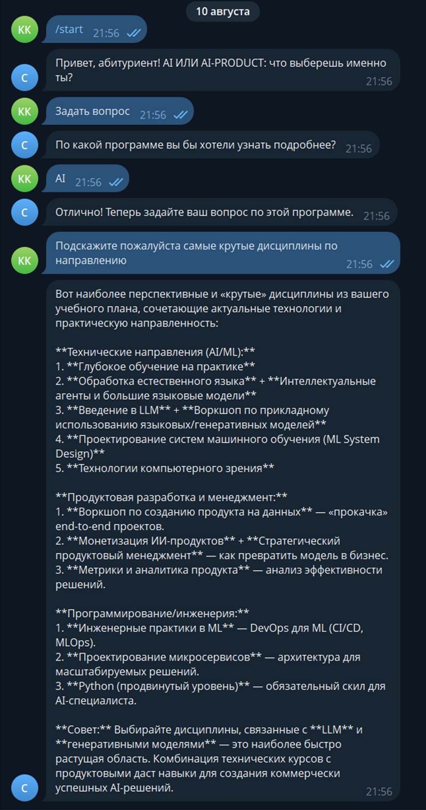
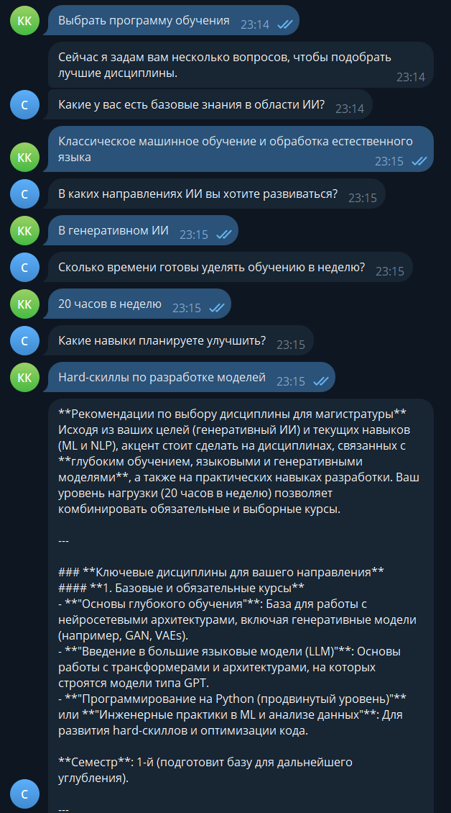

# choose_ai_itmo_bot

## Основные этапы:
- Парсинг учебных планов 
- Перевод учебных планов из pdf в csv с использованием camelot
- Разработка бота с использованием aiogram
- Для генерации ответов используется DeepSeek-R1 по API от HuggingFace

## Описание .env
- TG_API_TOKEN - токен тг-бота
- HF_API_URL - название модели (к примеру, 'deepseek-ai/DeepSeek-R1')
- HF_API_TOKEN - токен для hf

## Примеры работы:
1. Если есть вопрос к конкретной программе:


2. Если нет конкретных предпочтений, бот составит рекомендации, основываясь на вашем бэкграунде:
```
- Какие у вас есть базовые знания в области ИИ?
- В каких направлениях ИИ вы хотите развиваться?
- Сколько времени готовы уделять обучению в неделю?
- Какие навыки планируете улучшить?
```

